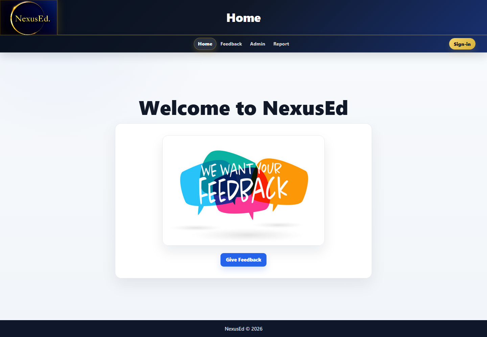
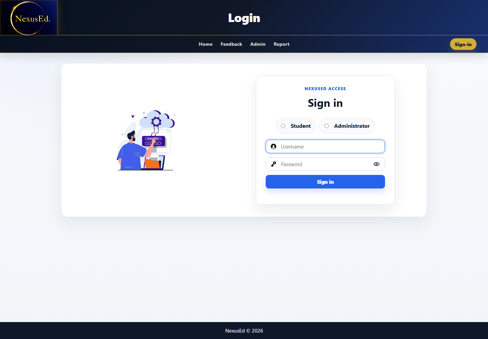
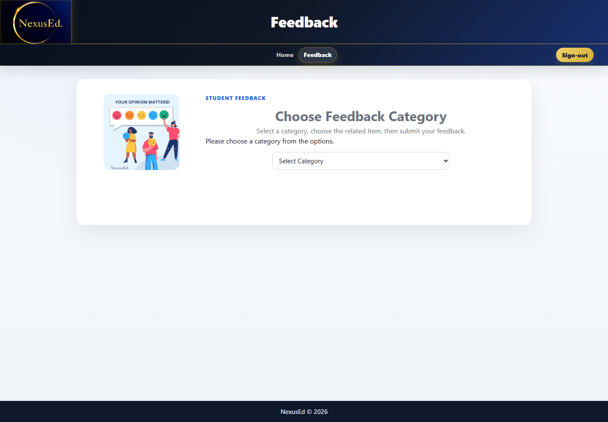
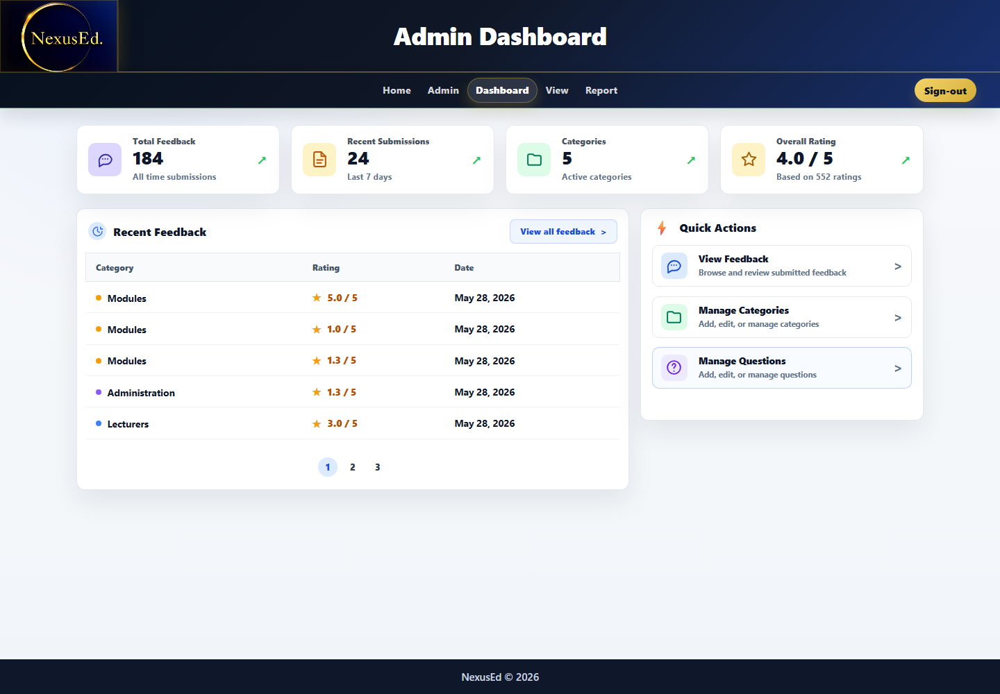
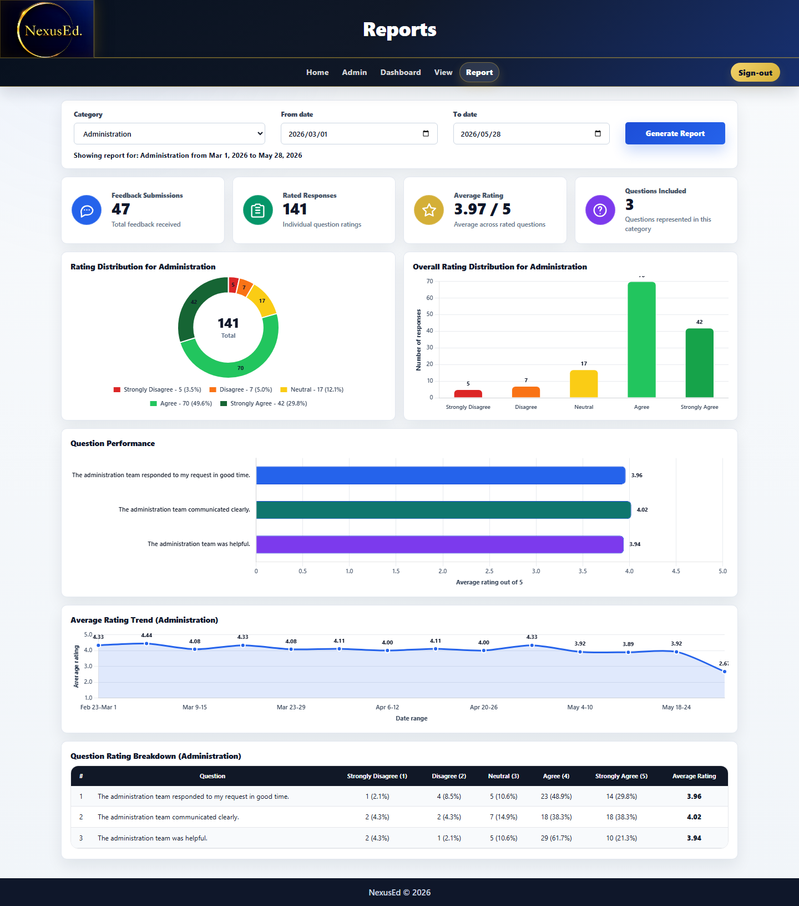

# NexusEd

NexusEd is a student feedback system for collecting, managing, and reviewing academic feedback.



## Features

| Area | Purpose |
| --- | --- |
| Student Feedback | Students sign in, choose a feedback category, answer rating questions, and submit comments. |
| Admin Tools | Administrators manage categories and feedback questions. |
| Dashboard | Administrators review operational feedback totals, recent submissions, and quick actions. |
| Reports | Administrators filter feedback data and review charts, trends, and question breakdowns. |

## Screens









## Run Locally

1. Open `NexusEd.sln` in Visual Studio.
2. Restore NuGet packages.
3. Create the local database with `DatabaseSetup.sql`, or add your own local database file as `App_Data/NexusEdLocal.mdf` and update `MyConnection` in `Web.config`.
4. Run the project with IIS Express.

## Key Files

```text
AdminDashboard.aspx       Operational admin dashboard
FeedbackCategory.aspx     Student feedback flow
Report.aspx               Reporting and chart dashboard
AuthNavigation.cs         Role-aware navigation and access checks
DatabaseSetup.sql         Local database setup and seed data
docs/screenshots/         Project screenshots
```

Local database files and build output are intentionally not committed. `DatabaseSetup.sql` contains sample development users and seed data for local testing.
